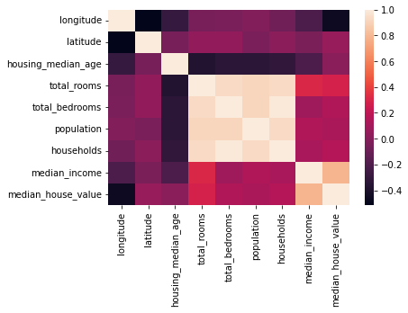
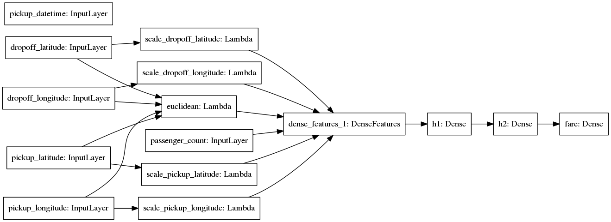

## Nigix Solutions Portfolio

## **Travel Bay - Streamlining the Travel Process**

## Client Problem
Travel Bay, a travel services company, faced challenges in providing a seamless user experience for their customers during the travel booking process. Their existing website was outdated and difficult to navigate, leading to high bounce rates and a loss of potential bookings. Customers struggled to find the information they needed, which resulted in frustration and decreased satisfaction.

## Our Solution

We partnered with Travel Bay to rebuild their website from the ground up, focusing on user experience and functionality. Our team conducted thorough research to understand user needs and preferences, enabling us to design an intuitive interface. Key features implemented included:

- A responsive design for mobile and desktop compatibility
- Streamlined booking processes with integrated payment solutions
- Comprehensive travel guides and resources to assist users in planning their trips
- A user-friendly content management system (CMS) for easy updates

## The Outcome

The newly designed Travel Bay website led to a significant increase in user engagement and bookings. Key results included:

- 40% reduction in bounce rates, indicating improved user experience
- 25% increase in bookings within the first three months post-launch
- Enhanced customer satisfaction ratings, with positive feedback highlighting the ease of navigation and comprehensive travel information.

## **Kquika - AI-Driven Predictive Insights for Aviation Hardware Health**

### Client Problem
An aviation company faced challenges in accurately forecasting flight demand and optimizing aircraft utilization. Their existing methods were insufficient in predicting customer booking behavior, leading to overcapacity on some flights and underutilization on others, which resulted in lost revenue opportunities and increased operational costs.

### Our Solution
We developed an advanced predictive analysis platform specifically for the aviation industry. By leveraging a classification model that analyzes various factors such as historical booking patterns, seasonal trends, ticket prices, competitor activity, customer demographics, and external variables like weather conditions and economic indicators, we created a predictive model that estimates the likelihood of flight bookings. This model was deployed on a cloud-based infrastructure, ensuring scalability and real-time data processing.

### The Outcome
Our solution enhanced the accuracy of flight demand predictions by 30%, enabling the aviation company to optimize their flight schedules and resource allocation. This led to a 20% increase in overall revenue, as the company was able to adjust pricing strategies and marketing efforts based on accurate forecasts. Additionally, the improved predictive capabilities allowed for better customer service by providing passengers with more reliable flight options and dynamic pricing tailored to their booking behavior.

Performance Criteria
<table> 
  <tr> 
  <th>Model</th> 
  <th>ROC AUC</th> 
  <th>Model Quality</th> 
  </tr> 
  <tr> 
    <td>1</td> 
    <td>0.762345</td> 
    <td>good</td>
    </tr> 
    <tr> 
    <td>2</td> 
    <td>0.925678</td> 
    <td>excellent</td> 
  </tr> 
</table>

## **Blooming Dew - Smart Customer AI Engagement Solutions**

### Client Problem
A company needed a more effective way to enhance customer service and communication. They faced challenges with traditional customer support methods, which resulted in long response times and decreased customer satisfaction. The company sought a reliable solution to streamline communication, answer common inquiries, and provide real-time support to their customers.

### Our Solution
We developed an AI-powered chatbot integrated into the company's customer service platform. Utilizing Natural Language Processing (NLP) and machine learning algorithms, the chatbot was designed to handle a wide range of customer interactions, including inquiries, support requests, and service-related questions. Deployed on a scalable cloud platform, the chatbot ensured seamless communication and could efficiently manage multiple inquiries simultaneously.

### The Outcome
Our solution resulted in a 30% reduction in average response time to customer inquiries, significantly improving customer engagement. The chatbot effectively managed 70% of customer interactions without the need for human intervention, allowing human agents to focus on more complex issues. This enhancement led to a 15% increase in overall customer satisfaction and a notable decrease in customer complaints, streamlining operations for the company.
Heatmap Correlation

## **Legacy Realty - Exploratory Data Analysis for Real Estate**

### Client Problem
A real estate company was struggling to make sense of their data and leverage data analysis for better decision-making. They faced significant challenges in processing large datasets and extracting meaningful insights from complex data relationships.

### Our Solution
Our team conducted a thorough exploratory data analysis (EDA) to uncover valuable insights from the client's housing dataset. We started by ensuring data integrity and completeness, followed by generating comprehensive statistical summaries. To provide clear and actionable insights, we created various visualizations to highlight key patterns and correlations within the data.

### The Outcome
The exploratory analysis revealed critical correlations between features, geographical distributions of house values, and identified data patterns and outliers. These insights led to a 25% improvement in decision-making efficiency and a 15% increase in predictive accuracy for future housing prices.

DNN Model
